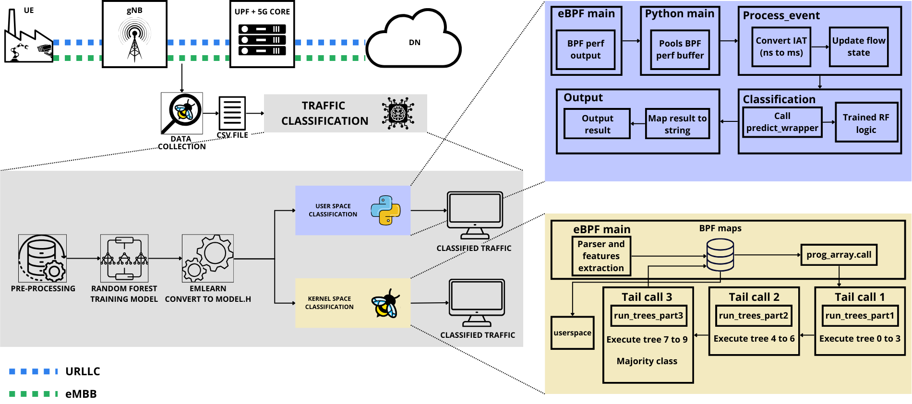

# Leveraging eBPF/XDP for Real-Time Machine Learning Traffic Classification in 5G User Plane Networks

This repository contains the source code and experimental artifacts related to the paper **“Leveraging eBPF/XDP for Real-Time Machine Learning Traffic Classification in 5G User Plane Networks.”**

The main objective of this work is to implement a **Random Forest traffic classifier inside a 5G User Plane Function (UPF)**, leveraging **eBPF/XDP** to enable traffic classification within a **privileged kernel space environment**.

The proposed solution supports traffic classification in **two execution environments: Kernel space and User space**

---

## Repository Structure

The repository is organized according to the classification environment:

- kernel_class/ # Kernel space traffic classification

- user_class/ # User space traffic classification

- data/ # Dataset used for training and evaluation

- figures/ # Figures used in the paper

- README.md

The PCAP file containing the traffic traces used in the experiments is available at  
**[google drive](https://drive.google.com/file/d/1KMSHgJQ_KaEnn4_jkOhRremd2-w9yVn1/view?usp=sharing)**

---

## Experimental Pipeline

The figure below illustrates the complete experimental pipeline, including traffic generation, data collection, model training, model conversion, and integration into both user space and kernel space environments.

Further implementation and evaluation details are provided in the paper.

---

## Requirements

- All `.py` and `.c` files belonging to the same scenario (**kernel space** or **user space**) must be located in the **same directory** when executed.
- The **BCC (BPF Compiler Collection)** library must be installed.

Installation instructions are available at:  
https://github.com/iovisor/bcc/blob/master/INSTALL.md

---

## Kernel Space Classification

The **kernel-space classifier** is implemented using eBPF/XDP and executes the Random Forest model within the kernel.

### Files

Located in the `kernel_class` directory:

- **`monitorjanela.py`**  
  User space control program responsible for:
  1. Compiling and loading the eBPF program into the kernel  
  2. Attaching the XDP program to the network interface  
  3. Populating the `PROG_ARRAY` used for tail calls  
  4. Reading events from the `perf_buffer` and formatting them for terminal output  

- **`monitorjanela.bpf.c`**  
  Kernel-space eBPF/XDP program responsible for:
  1. Decapsulating Ethernet, IP, UDP, and GTP-U headers to access the inner user IP address  
  2. Computing the mean and variance of the Inter-Arrival Time (IAT) within a 500 ms window  
  3. Executing the Random Forest decision trees using tail calls (`model500msJANELA.h`)  
  4. Sending classification results and metadata to user space  

- **`model500msJANELA.h`**  
  Header file generated by **[emlearn](https://github.com/emlearn/emlearn)**, containing the decision tree structures and prediction functions used by the kernel-space classifier.

---

## User Space Classification

In the **user space classifier**, eBPF/XDP is used only for metric collection, while classification is performed in user space via a shared C library.

### Files

Located in the `user_class` directory:

- **`monitor.py`**  
  User space control program responsible for:
  1. Compiling and loading the eBPF program into the kernel  
  2. Attaching the XDP program to the network interface  
  3. Receiving events via `perf_buffer`  
  4. Computing the mean and variance every 500 ms and invoking the classification library (`libclassifier.so`)  

- **`monitor.bpf.c`**  
  Kernel space eBPF/XDP program responsible for:
  1. Decapsulating Ethernet, IP, UDP, and GTP-U headers to access the inner user IP address  
  2. Computing the Inter-Arrival Time (IAT)  
  3. Sending metadata to user space  

  *In this scenario, the eBPF program acts solely as a data collector, forwarding metrics to user space for classification.*

- **`model500msJANELA.h`**  
  Header file generated by **emlearn**, containing the Random Forest decision tree structures.

- **`wrapper.c`**  
  Adaptation layer that enables the emlearn-generated C model to be executed directly from Python (`monitor.py`).

- **`libclassifier.so`**  
  Shared library compiled from `wrapper.c`, used for user-space classification.

---

## Additional Information

For more details about the system architecture, model training, and performance evaluation, please refer to the associated paper.
